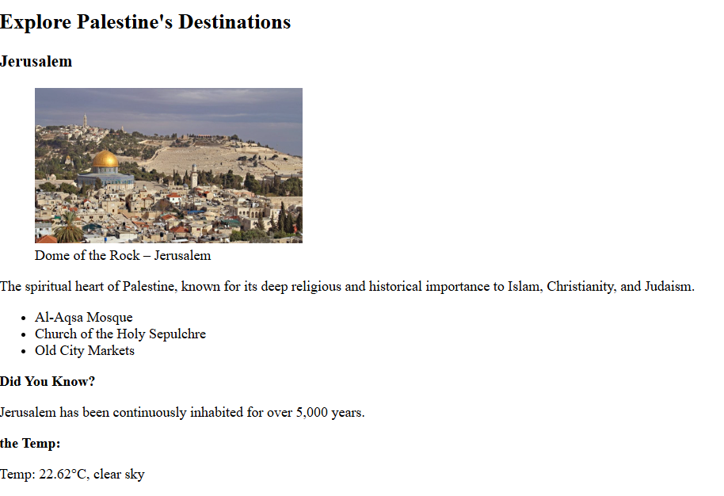
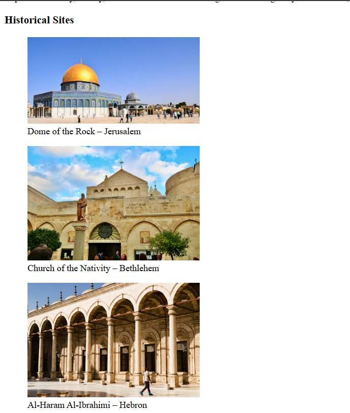
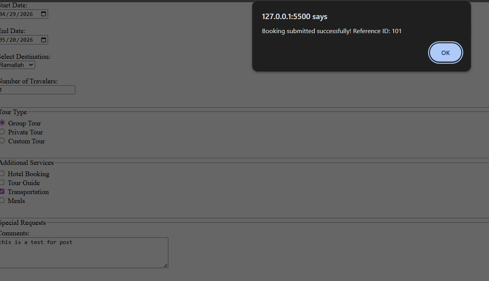

<p align="center">
  
</p>

<h1 align="center">🌍 Falasteen Trails – RESTful Web Services Project</h1>

<p align="center">
  A semantic travel website enhanced with real-world REST API integration for dynamic content (weather, images, and booking simulation).
</p>

<p align="center">
  
  
  
  
</p>

---

## 📖 Overview
 
**COM4381 – Web Services Technologies (Assignment 1)**.

The project demonstrates how to **consume RESTful APIs directly in a frontend environment** using vanilla HTML, CSS, and JavaScript.

It builds on a **semantic HTML travel website** and extends it with real-time data integration from external services.

---

## 🎯 Assignment Objective

This project fulfills the following requirements:

### Part 1 – REST API Exploration (Conceptual + Demo)
- Identify service providers (e.g., Unsplash, OpenWeatherMap)
- Understand API endpoints and resources
- Demonstrate HTTP methods (`GET`, `POST`)
- Analyze JSON responses and query parameters
- Show real-world use cases of APIs in travel systems

### Part 2 – API Consumption via Client Code
- Consume REST APIs using **Fetch API**
- Display dynamic data in a web interface
- Build a functional frontend client without backend frameworks

---

## 🌐 APIs Used

### 📸 Unsplash API (Image Service)
- Used in **Gallery page**
- Dynamically loads images for:
  - Historical sites
  - Landscapes
  - Cultural events
- Uses `GET /search/photos`

### 🌤️ OpenWeatherMap API (Weather Service)
- Used in **Destinations page**
- Displays live weather per city:
  - Jerusalem
  - Bethlehem
  - Ramallah
  - Jericho
  - Hebron
  - Nablus

### 📬 JSONPlaceholder API (POST Simulation)
- Used in **Booking form**
- Simulates real booking submission using `POST`
- Returns response with generated ID

---

## 🚀 Features

- Semantic HTML5 structure (headers, sections, articles, aside)
- Dynamic image gallery (Unsplash API)
- Live weather integration per destination
- Interactive booking form
- POST request simulation for reservations
- Clean navigation across pages
- Real-world REST API demonstration

---

## 🧰 Technologies Used

| Technology | Purpose |
|------------|--------|
| HTML5 | Semantic structure |
| JavaScript | API integration & logic |
| Fetch API | HTTP requests |
| Unsplash API | Image retrieval |
| OpenWeatherMap API | Weather data |
| JSONPlaceholder | POST request simulation |

---

## 📡 REST Concepts Demonstrated

This project demonstrates key REST principles:

- Resources (images, weather, booking data)
- HTTP Methods:
  - `GET` → Fetch images & weather
  - `POST` → Submit booking data
- Query Parameters (city names, search keywords, API keys)
- JSON responses and parsing
- Client-side API consumption without backend

---

## 📁 Project Structure

```

Falasteen-Trails/
│
├── index.html
├── destinations.html
├── gallery.html
├── booking.html
│
├── images/
│   ├── logo.png
│
└── README.md

````

---

## 📸 Screenshots

| Page | Preview |
|------|--------|
| Destinations |   |
| Gallery |  |
| Booking Form |  |

---

## ⚙️ How to Run

1. Clone the repository:
```bash
git clone https://github.com/abdallahabed/Falasteen-Trails.git
````

2. Open the project folder

3. Open any page directly in browser:

```
index.html
```

(No server required)

---

## 🧠 Key Learning Outcomes

* Understanding RESTful APIs in real-world applications
* Using `fetch()` for HTTP requests
* Working with JSON responses
* Integrating multiple APIs into a single frontend project
* Building dynamic content without frameworks
* Applying semantic HTML structure correctly

---

## 👨‍💻 Developer

**Abdallah Aabed**
**id: 1210802**
Computer Science Student – Birzeit University
Web Development • JavaScript • APIs • Data Systems

GitHub: [abdallahabed GitHub](https://github.com/abdallahabed)

---

## 📜 License

Academic project for **COM4381 – Web Services Technologies**
Educational use only.

